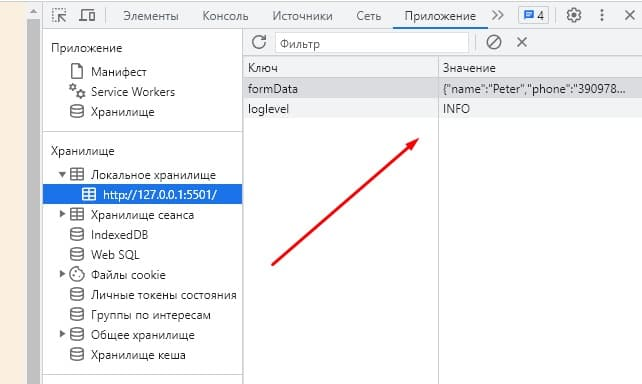

# **This is a small test menu page**

---

### Page made according to the requirements sent in the letter.

#### Stack used:

- HTML5
- CSS
- SCSS
- JavaScript

---

##### Modal wind send a data on local storage and clien get a response about succeful oder

---

##### When you hover the mouse over the picture, the text with the reviews and the price

---

##### In a footer modal window with contact of reustoran

---

##### localStorage screen

